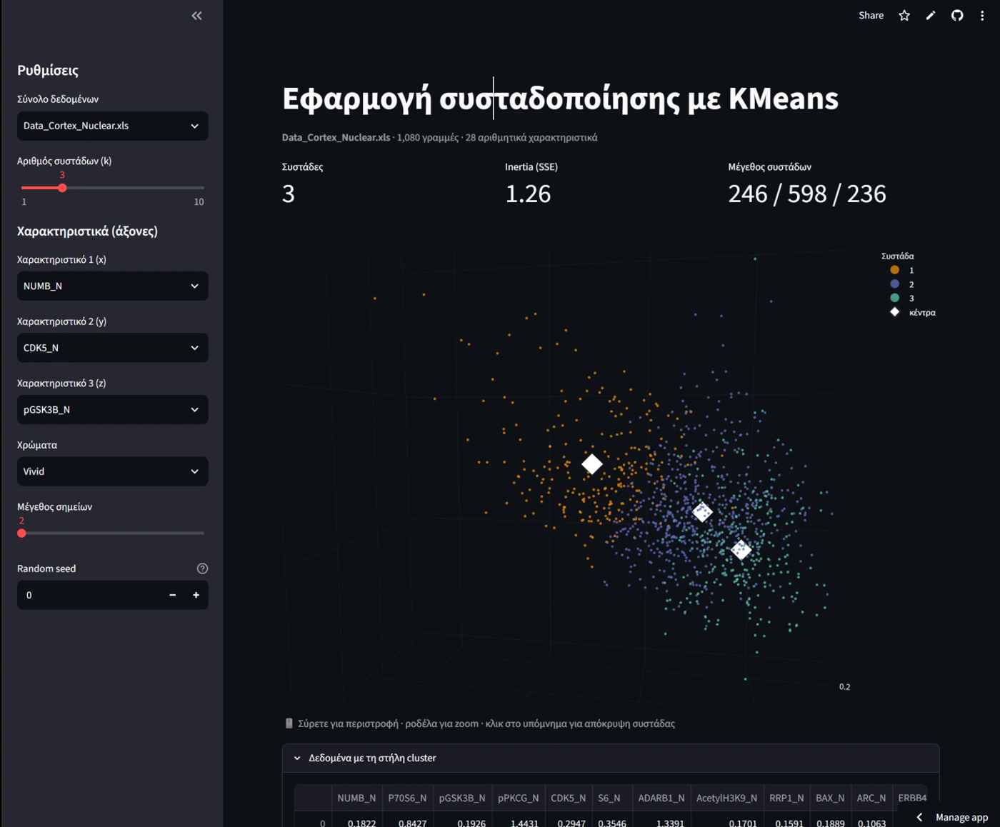

# K-Means Clustering App · Εφαρμογή συσταδοποίησης με KMeans

[](https://leopoldos-kmeans.streamlit.app)
[](LICENSE)

Interactive k-means clustering on 10 real datasets, with a rotatable 3D plot of the clusters and their centroids.

**▶ Try it online, nothing to install: https://leopoldos-kmeans.streamlit.app**



## Features

- Pick one of **10 datasets** (see below)
- Choose the number of clusters **k** (1–10) and any **3 numeric features** as the x / y / z axes
- **Interactive 3D chart** (Plotly): drag to rotate, scroll to zoom, hover a point to see its values and real class, click the legend to hide a cluster
- Cluster **centroids**, cluster sizes and inertia (SSE)
- Data table with the assigned `cluster` column and **CSV download**
- Colour palettes, point size, and a random seed for reproducible results

## Datasets

All from the [UCI Machine Learning Repository](https://archive.ics.uci.edu/):

| File | Dataset |
|---|---|
| `winequality-red.csv`, `winequality-white.csv` | Wine Quality |
| `HTRU_2.csv` | HTRU2 (pulsar candidates) |
| `ecoli.data` | Ecoli |
| `yeast.data` | Yeast |
| `abalone.data` | Abalone |
| `iris.data` | Iris |
| `Data_Cortex_Nuclear.xls` | Mice Protein Expression |
| `BreastTissue.xls` | Breast Tissue |
| `CTG 2.xls` | Cardiotocography |

## Run it yourself

The app comes in two versions that share the same datasets:

| Version | File | Interface |
|---|---|---|
| **Web** | `streamlit_app.py` | Streamlit + Plotly, runs in the browser |
| **Desktop** | `ClusterigAppwSelection/LoadMyProjectwith3Selections.py` | Tkinter + Matplotlib window |

```bash
git clone https://github.com/Leopoldoszoombazoom/ClusteringAppwSelection.git
cd ClusteringAppwSelection
python -m venv .venv
.venv\Scripts\activate          # Windows  (macOS/Linux: source .venv/bin/activate)
pip install -r requirements.txt

streamlit run streamlit_app.py                                   # web version
python ClusterigAppwSelection/LoadMyProjectwith3Selections.py    # desktop version
```

### Windows .exe (desktop version)

`build.ps1` packages the desktop app with PyInstaller into `dist\ClusteringApp\ClusteringApp.exe` (plus a zip), so it runs on PCs without Python:

```powershell
powershell -ExecutionPolicy Bypass -File build.ps1
```

The .exe is not code-signed, so Windows SmartScreen or Smart App Control may warn about it or block it. The online version avoids this.

## License

[MIT](LICENSE) © Leopoldos
